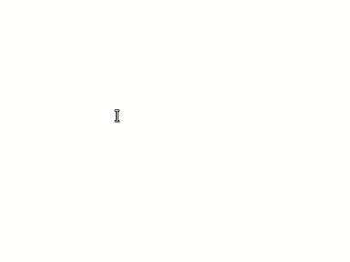
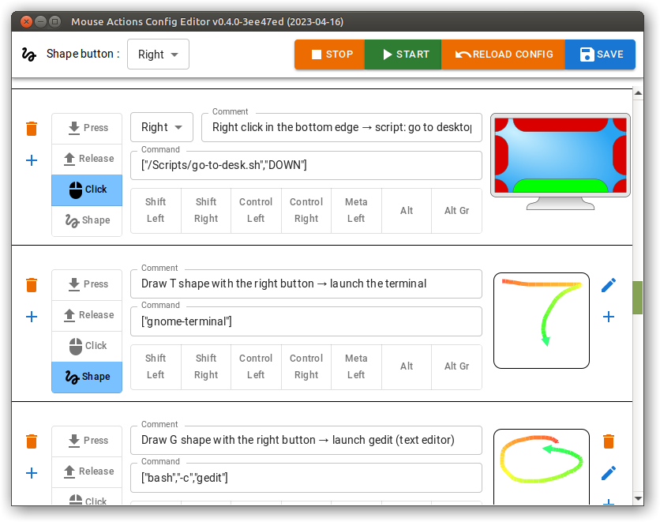
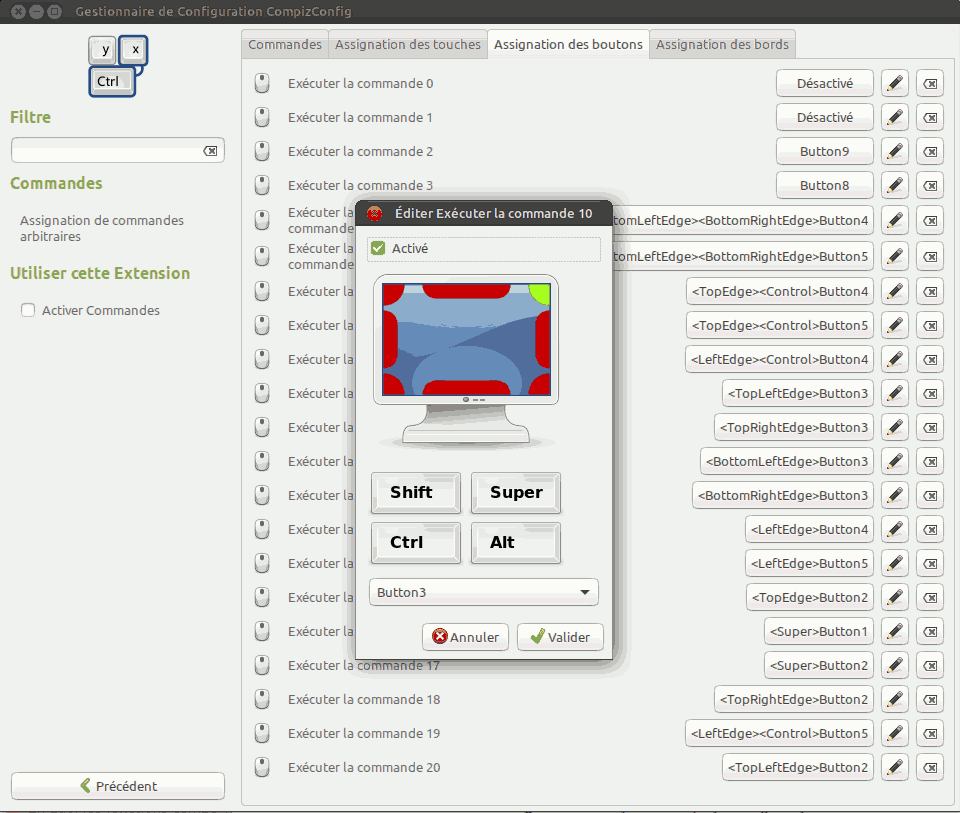
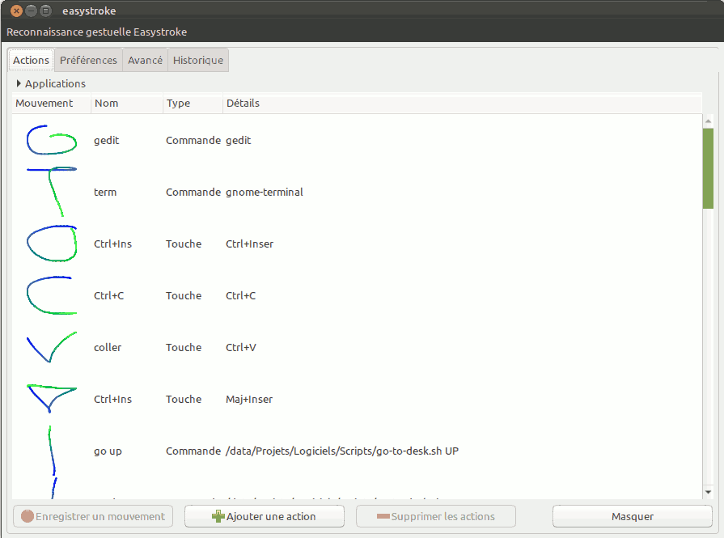

# Mouse actions


[](https://github.com/jersou/mouse-actions/actions)

mouse_actions allows to execute some commands from mouse events such as:

* clicks / wheel on the side / corners of the screen,
* or drawing shapes.

It's a mix between [Easystroke](https://github.com/thjaeger/easystroke)
and [Compiz edge
commands](http://wiki.compiz.org/CCSM#Mouse_Buttons).

For instance, you can configure:

* a click in the top left corner of the screen to go to the first desktop,
* a middle click on the top side of the screen to play/pause the media,
* scroll from the left side to increase/decrease the brightness of the
  screen,
* scroll from the top-left corner to increase/decrease the volume,
* draw a `T` with the mouse right button pressed to open a terminal,
* draw a `G` with the mouse right button pressed to open a text editor (gedit),



The GUI to configure the application :



## Features

Bind command execution with mouse button/wheel events (this conditions bellow
are optional):

* Shape drawing with the mouse (like Easystroke)
* Press/release only or click (don't propagate the press & release event)
* With some modifiers : shift/Ctrl/Alt...
* With screen edge : Top/Left...
* Auto reload config on changes
* Very low resource usage
    * Fast shape recognition : ~200µs (0.0002 sec) for a config with 30 shapes
    * Fast event without shape processing : ~30µs (0.00003 sec)
    * CPU : ~7 sec CPU usage per hour (~0.2%)
    * RAM : 5.6 Mo (GUI less version)
* Works under Wayland but with limitations, see the "Platform compatibility"
  section below.

## Project status

**⚠️ Alpha version ⚠️**

My feedback on Linux/X11 : after 10 month of daily use (since 15/05/2022) and
300'000 triggers, it's works well and X11 has not crashed (Unlike Easystroke
which made X11 crash every day before on my laptop).
With my usage, mouse_actions triggers commands about once/twice per minute, and
half of which by shape bindings.

## Known bugs

* when a device (like mouse or bluetooth earphone) is added, the mouse/keyboard
  modifier are locked : if Ctrl is pressed during this plug, Ctrl keep pressed.
  A workaround for me is to switch : Ctrl+Alt+F1 & Ctrl+Alt+F7.
* when a device (like mouse or bluetooth earphone ) is added, the cursor freeze
  while 2 seconds or the mouse_actions program may crash.

**→ a fix (2023-07-07) disable the detection of new devices from rdev → no
crash but new devices may not be usable with MA without restarting it**

* On PC suspend, the mouse_actions program may crash
* On wayland, the gesture button event is not propagated if there are no
  detected gesture #8.
* Under Linux with Nvidia gpu, the GUI window is blank #38, [it's an open bug
  of Tauri](https://github.com/tauri-apps/tauri/issues/9304) but there is a
  workaround : set the env var `WEBKIT_DISABLE_DMABUF_RENDERER=1`

## Install / run

[Download the release](https://github.com/jersou/mouse-actions/releases), the 2
release binaries `mouse-actions` and `mouse-actions-gui` are standalone (but use
the same configuration), the avantage of using GUI less version is the RAM
usage : 5.6 Mo vs 34 Mo.

The gui unbundled standalone binary need this packages :

* Debian/Ubuntu : libwebkit2gtk-4.0-37, libgtk-3-0
* Arch : webkit2gtk, gtk3
* Fedora : webkit2gtk3, gtk3

The AppImage and deb releases includes these dependencies.

### Release types

* mouse-actions-gui-vX.X.X.tar.gz (2 MB) : GUI version standalone binary
* mouse-actions-gui_X.X.X_amd64.AppImage (69 MB) : GUI version AppImage,
  includes webkit2gtk & gtk3
* mouse-actions-gui_X.X.X_amd64.deb (2.5 MB) : GUI deb package, includes
  webkit2gtk & gtk3 ref
* mouse-actions-vX.X.X.tar.gz (1 MB) : GUI less version standalone binary

### Build

* GUI less version : `cargo build --release`
* GUI version : `cd config-editor && npm i && npm run tauri-build`

### Requirement :

To use the main feature "grab event", you need to have the read&write permission
on `/dev/input/event*`. Check the group of `/dev/input/event*` files :

```bash
ls -al /dev/input/event*
# > crw-rw---- 1 root input /dev/input/event5
#                     ^^^^^
```

You need to add the current user to this group, usually `input` or `plugdev` :

```bash
sudo usermod -a -G plugdev $USER
# or
sudo usermod -a -G input $USER
```

Furthermore, you must have the read&write permission on `/dev/uinput`, you can
check with:

```bash
getfacl /dev/uinput
# ...
# user:<the current user>:rw-
# ...
```

If this permission is not available on the user, to add it
temporary : `sudo setfacl -m u:$USER:rw /dev/uinput` or persistent :

```bash
sudo tee /etc/udev/rules.d/80-mouse-actions.rules <<<'KERNEL=="uinput", SUBSYSTEM=="misc", TAG+="uaccess", OPTIONS+="static_node=uinput"'
```

You need to restart your desktop session to apply these changes.

To check the user groups and the ACL after the session restart or the reboot:

```bash
$ groups
... input ...
$ getfacl /dev/uinput
# ...
# user:<the current user>:rw-
# ...
```

**⚠️ The changes introduced by this chapter may cause security problems:
an application launched with your user can listen to your input events ⚠️**

### Platform compatibility

I only tested it on Linux + X11 and Linux + Wayland, but it should work on Mac,
Windows.

The `grab` feature from rdev give an inaccurate mouse position, so Mouse_actions
used the `listen` feature from rdev. This function not works on Wayland and the
listen feature is used to detect edge of screen click, so this edge actions
doesn't works on Wayland (no absolute mouse position).

#### Wayland

Notes:

* Edge screen event doesn't work with Wayland.
* but the mouse shape actions works !
* #8 `Gesture button is 'stolen' on Wayland`, this bug should be fixed in the
  future
* xdotool doesn't work on Wayland, use ydotool or other alternatives to simulate
  keyboard event.

## Configuration

### config editor

Run `mouse-actions-gui` to edit the configuration.

### Configuration file format

The config file default path is `~/.config/mouse-actions.json`

#### Structure

* `shape_button`: the mouse button to use to draw shapes :
  `Left` | `Right` | `Middle` | `Side` | `Extra` | `Forward` | `Back`
  | `Task` | `Trigger` | `Thumb` | `Thumb2` | `WheelUp` | `WheelDown`
  | `Unknown` | `None`

* `bindings` : array of binding :
    * `cmd_str` : command line to exec
    * `event`: object :
        * `button`: `Left` | `Right` | `Middle` | `Side` | `Extra` | `Forward`
          | `Back`
          | `Task` | `Trigger` | `Thumb` | `Thumb2` | `WheelUp` | `WheelDown`
          | `Unknown` | `None`
        * `edges`: array of : `Top`,`Right`,`Bottom`,`Left`,
        * `event_type`: `Press` | `Release`| `Click`
        * `modifiers`: array of :  `ShiftLeft`, `ShiftRight`, `ControlLeft`,
          `ControlRight`, `MetaLeft`, `Alt`, `AltGr`
        * `shapes_xy`: the shapes, array of arrays of coordinates. The best
          shape match will be used.

## CLI usage

```
Usage: mouse_actions [OPTIONS] [COMMAND]

Commands:
  show-gui        Default command with mouse-actions-gui, show Mouse Actions Config Editor
  start           Default command with mouse-actions, Start mouse_actions bindings
  trace           Trace events
  record          Start record mode to add some mouse bindings
  list-bindings   List the current config bindings
  grab-one-event  Grab one event, print it and exit
  stop            Stop mouse action
  status          Get mouse action status : exit 0 if running
  show-config     print the json config
  set-config      set the json config from stdin
  help            Print this message or the help of the given subcommand(s)

Options:
  -n, --no-listen                  don't run the listen thread (for Wayland), the edge bindings might not work
  -c, --config-path <CONFIG_PATH>  config path, default : ~/.config/mouse-actions.json
  -v, --version                    print version
  -l, --log-level <LOG_LEVEL>      log level : error, warn, info, debug, trace. [default=info]
  -h, --help                       Print help
```

### LOG : RUST_LOG env var & --log-level option

The project use [env_logger](https://github.com/rust-cli/env_logger/) to
log. The log levels : error, warn, info, debug, trace.

`RUST_LOG=debug ./mouse_actions` or `./mouse_actions --log-level debug` output:

```
[DEBUG] Binding without shape found : Binding { comment: "Middle click in the top left corner → script: key ² → open Tilda", event: ClickEvent { button: Middle, edges: [Left, Top], event_type: Click}, cmd: ["xdotool", "key", "49"] }
[DEBUG] Process event duration : 39.74µs
[INFO ]      → cmd ["xdotool", "key", "49"]
[DEBUG] ----------------------------------------
[DEBUG] angles: 3.14, 3.14, -3.07, -3.07, -3.04, -3.04, -2.96, ...
[DEBUG] find_candidates_with_shape_with_offset duration : 81.714µs
[DEBUG] shape candidates=
[DEBUG]    75.29 %    0.50 : Draw G shape with the right button → launch gedit (text editor)                        ["gedit"]
[DEBUG]    56.13 %    0.66 : Draw S shape with the right button → Ctrl+S key (save)                                 ["xdotool", "key", "ctrl+s"]
[DEBUG]    25.80 %    0.86 : Draw D shape with the right button → Ctrl+Alt+D key (show the window on all desktops)  ["xdotool", "key", "ctrl+alt+d"]
[DEBUG]    11.70 %    0.94 : Draw H shape with the right button → Ctrl+H key (toggle hide)                          ["xdotool", "key", "ctrl+h"]
[DEBUG] Process event duration : 145.143µs
[INFO ]      → cmd ["gedit"]
[DEBUG] ----------------------------------------
[DEBUG] angles: 0.00, 0.13, 0.13, 0.20, 0.15, 0.15, 0.23, 0.23, ... 
[DEBUG] find_candidates_with_shape_with_offset duration : 113.35µs
[DEBUG] shape candidates=
[DEBUG]    84.78 %    0.39 : Draw T shape with the right button → launch the terminal                                        ["gnome-terminal"]
[DEBUG]    49.18 %    0.71 : Draw Z shape with the right button → Ctrl+Z key (undo)                                          ["xdotool", "key", "ctrl+z"]
[DEBUG]    18.31 %    0.90 : Draw ↘ (line to the bottom right) shape with the right button → Alt+F8 key (resize the window)  ["xdotool", "key", "alt+F8"]
[DEBUG]    13.46 %    0.93 : Draw n shape with the right button → launch nemo (file explorer)                                ["nemo"]
[DEBUG] Process event duration : 194.956µs
[INFO ]      → cmd ["gnome-terminal"]
```

→ 3 events :

* `Middle click in the top left corner`
* `Draw G shape with the right button`
* `Draw T shape with the right button`

## Exemple : big config

* mouse button bindings:
    * Super+Left click → screenshot script
    * Side click → script: Alt + Left mouse down
    * Extra click → script: Alt + Tab

* edges and corners bindings:
    * Middle click in the top left corner → script: key ² → open Tilda
    * Middle click in the top right corner → script: lock the screen
    * Middle click in the top edge → script: play/pause
    * Right click in the top left corner → script: go to the top left desktop
    * Right click in the top right corner → script: go to the top right desktop
    * Right click in the bottom left corner → script: go to the bottom left
      desktop
    * Right click in the bottom right corner → script: go to the bottom right
      desktop
    * Wheel up in the top left corner → script: increase volume
    * Wheel up in the top right corner → script: increase volume
    * Wheel up in the bottom left corner → script: increase volume
    * Wheel up in the bottom right corner → script: increase volume
    * Wheel down in the top left corner → script: decrease volume
    * Wheel down in the top right corner → script: decrease volume
    * Wheel down in the bottom left corner → script: decrease volume
    * Wheel down in the bottom right corner → script: decrease volume
    * Ctrl + Wheel up in the top edge → script: audio next
    * Ctrl + Wheel up in the top edge → script: audio previous
    * Wheel up in the left edge → script: increase brightness 1%
    * Ctrl + Wheel up in the top edge → script: increase brightness 10%
    * Wheel down in the left edge → script: decrease brightness 1%
    * Ctrl + Wheel down in the left edge → script: decrease brightness 10%
    * Right click in the left edge → script: go to desktop on the left
    * Right click in the top edge → script: go to desktop on the top
    * Right click in the right edge → script: go to desktop on the right
    * Right click in the bottom edge → script: go to desktop on the bottom

* Shape biding with the right button :
    * Draw G shape → launch gedit (text editor)
    * Draw T shape → launch the terminal
    * Draw C shape → key Ctrl+C (Copy)
    * Draw V shape → key Ctrl+V (Paste)
    * Draw ↑ (vertical line to the top) shape → go to the desktop on the top
    * Draw ↓ (vertical line to the bottom) shape → go to the desktop on the top
    * Draw → (horizontal line to the right) shape → go to the desktop on the
      right
    * Draw ← (horizontal line to the left) shape → go to the desktop on the left
    * Draw N shape → open the Note tool
    * Draw ↗ (line to the top right) shape → F2 key (rename)
    * Draw ↖ (line to the top left) shape → F2 key (rename)
    * Draw ↙ (line to the left bottom) shape → Alt+Tab key
    * Draw n shape → launch nemo (file explorer)
    * Draw m shape → launch nautilus (file explorer)
    * Draw ↘ (line to the bottom right) shape → Alt+F8 key (resize the window)
    * Draw S shape → Ctrl+S key (save)
    * Draw ∝ (alpha) shape → Ctrl+X key (cut)
    * Draw ɣ (gamma) shape → Ctrl+X key (cut)
    * Draw ↵ (bottom then left) shape → Ctrl+X key (cut)
    * Draw ↶ (reverse n) shape → show/hide hamster time tracker
    * Draw Z shape → Ctrl+Z key (undo)
    * Draw F shape → Ctrl+F key (search)
    * Draw H shape → Ctrl+H key (toggle hide)
    * Draw D shape → Ctrl+Alt+D key (show the window on all desktops)
    * Draw B shape → script to remove the window decoration
    * Draw 2 shape → Shift+F9 key clear draw on screen (Gromit-MPX)
    * Draw 𝛥 shape (↗↘←) → F9 key toggle draw on screen (Gromit-MPX)

## Development

This project use [rdev crate](https://crates.io/crates/rdev) that
use [Evdev](https://en.wikipedia.org/wiki/Evdev) to grab mouse Event.

### Motivations

* I used [Easystroke](https://github.com/thjaeger/easystroke) a lot but its
  development stopped in 2014, and it causes my system to crash regularly.
* Besides, I was also using a lot Compiz screen corner command bindings, and I
  wanted to have these bindings without necessarily using compiz.

The goal of this project is then to have these 2 features without having
OS crash (X11 crash).

CCSM screenshot (Compiz Config Setting Manager) :


Easystoke screenshot :


### Dev notes :

#### Shape recognition

Shape recognition : compare angles, get the average of the angles differences :


The calculated difference is approximately the area between the 2 curves of
angles (mod 2𝜋) visible on the right of the above image.

Get the minimum difference by shifting a curve horizontally: try removing the
beginning or the end, by +/- 10 % max offset (max 20 try).

#### upgrade

```bash
cargo update
cargo audit
cargo test
cargo build --release

cd config-editor
npm install @tauri-apps/cli@latest @tauri-apps/api@latest

cd src-tauri
cargo update
cargo audit
```

## TODO

### High

* #8 Gesture button is 'stolen' on Wayland
* config file for /dev/input/event* in /etc/udev/rules.d/? instead of the
  usermod if possible, script to create this file, add to the deb package, ...

### Medium

* CI: build the releases https://github.com/tauri-apps/tauri-action
* change config : if shape → (no need button in binding) or (rm shape_btn :
  several button for shape event is then possible)
* cancel shape if no move after few ms (400 ms ?)
* fix `TODO` and `FIXME`
* fix rdev
    * reset the modifiers/button state at root loop restart
    * fix rdev devices delete/update: the FIXME "inotify CREATE but not DELETE
      in grab::inotify_devices()" in rdev/src/linux/grab.rs:493
    * pull request/contribute/modify rdev without fork it in this repo (
      mouse btn add & fix devices setup/Delete notify)
* add ARM64 target #6

### Low

* re-enable the new device detection, disabled by the v0.4.4
* support Windows & macOS
* fix exec cmd not found
  error
  `Err(Os { code: 2, kind: NotFound, message: "No such file or directory" })`
* create ~/.config if it doesn't exist
* use https://github.com/hoodie/notify-rust
* a better Readme
* improve shape recognition
* refactor
    * don't use arrayvec ?
    * reduce clone() usages
    * handle errors correctly : remove panic, reduce unwrap
    * refactor Arc/Mutex usages
    * refactor/change the pressState usage
    * dev doc, tests
* use rdev send() ? → cmd OR sendKeys in bindings (or autopilot-rs) :  trigger
  keyboard event as action (avoid xdotool usage in
  cmd) : https://github.com/Narsil/rdev#sending-some-events

### Maybe

* use https://crates.io/crates/deno_task_shell to execute commands ?
* release a debug version and a gui-less version ?
* options
    * dry-run option
    * min diff shape config option
    * min score shape config option
* find a better project name and icon
* notif/sound/cursor change on action trigger success/failure (
  configurable) ? https://crates.io/crates/rodio
* mouse move edge event ?
* hide/freeze cursor while shape drawing ?
* Ctrl alias for ControlLeft & ControlRight, Shift for ShiftLeft & ShiftRight,
